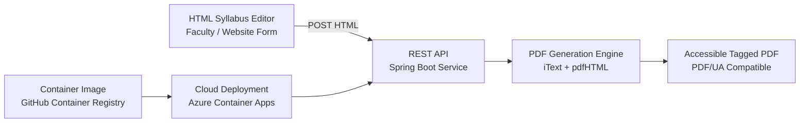

# Accessible Syllabus PDF Generator

## Overview

This project provides a **cloud-native microservice for generating accessible syllabus documents**.

The service converts **semantic HTML syllabus content into tagged PDF documents** that are compatible with screen readers and accessibility validators.

The system was created to help universities meet **ADA, Section 508, and institutional accessibility requirements** while minimizing the cost and effort traditionally associated with accessible document remediation.

Instead of relying on manual accessibility fixes or expensive document platforms, this service automatically produces **structured, accessible PDF output directly from HTML syllabus content**.

---

# Why This Project Exists

Many universities require syllabi to be:

- publicly accessible on department websites
- compliant with accessibility regulations
- usable by screen readers and assistive technologies

However, traditional approaches create several challenges.

## Common Institutional Approaches

### 1. Manual Accessibility Remediation

Faculty or accessibility specialists manually fix documents after they are created.

Problems:

- time intensive
- inconsistent results
- requires specialized training

---

### 2. Vendor Accessibility Services

Some institutions outsource document remediation.

Typical cost:

```
$5 – $10 per page
```

For large universities with hundreds of syllabi per semester, this becomes expensive quickly.

---

### 3. Commercial Syllabus Platforms

Some universities purchase centralized syllabus management platforms.

Typical costs:

```
$20,000+ annually
```

These systems often introduce administrative overhead and vendor lock-in.

---

# The Approach in This Project

This project explores a different model:

**Generate accessible documents automatically from structured HTML.**

Because modern HTML already contains semantic meaning (headings, lists, paragraphs, etc.), it can be transformed into properly tagged PDF documents programmatically.

The service:

1. Accepts structured HTML syllabus content
2. Converts HTML to a tagged PDF
3. Preserves document structure and reading order
4. Produces output compatible with screen readers

The result is **consistent accessibility with minimal manual effort**.

---

# System Architecture

The service is implemented as a **cloud-native microservice** that converts structured HTML syllabus content into accessible PDF documents.


```
HTML Syllabus Form
        ↓
POST Request
        ↓
Spring Boot API
        ↓
iText + pdfHTML
        ↓
Tagged Accessible PDF
        ↓
Download
```

The service is designed as a **stateless REST microservice**, allowing it to scale easily in cloud environments.

---

# Technology Stack

## Backend

```
Java 17
Spring Boot
Maven
```

## PDF Generation

```
iText PDF
pdfHTML
```

## Containerization

```
Docker
GitHub Container Registry
```

## Deployment

```
Azure Container Apps
```

This architecture enables **on-demand serverless execution with minimal operational cost**.

---

# API Endpoint

The service exposes a simple REST endpoint:

```
POST /api/export/pdfua
```

The request body contains HTML content.

Example request:

```http
POST /api/export/pdfua
Content-Type: text/html
```

The response returns a generated PDF file.

---

# Accessibility Features

The generated PDFs include:

- tagged document structure
- preserved reading order
- heading hierarchy
- semantic content mapping
- language metadata

These elements allow screen readers and accessibility validators to interpret the document correctly.

---

# Example Use Case

A university syllabus editor produces structured HTML such as:

```html
<h1>Course Syllabus</h1>
<h2>Course Description</h2>
<p>...</p>
```

The microservice converts this into a **properly tagged accessible PDF** ready for distribution or website publication.

---

# Benefits

This approach provides several institutional advantages.

## Accessibility by Design

Documents are generated with accessibility built in rather than retrofitted later.

## Cost Efficiency

Automation reduces reliance on external remediation services.

## Consistency

All generated syllabi follow the same accessible structure.

## Scalability

A stateless microservice can support hundreds or thousands of documents.

---

# Future Directions

Possible extensions include:

- automated accessibility validation reports
- integration with learning management systems
- support for additional academic documents such as:

  - handbooks
  - policy documents
  - program guides

---

# Research Context

This project is part of ongoing work exploring how **cloud-native infrastructure can support accessibility compliance in higher education**.

The system demonstrates that accessible document generation can be automated at scale using modern web and container technologies.

---

# License

MIT License
